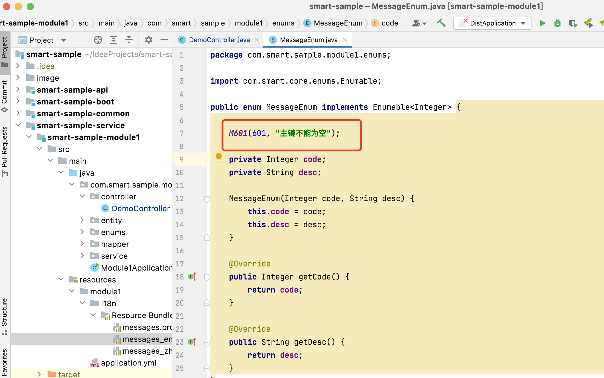
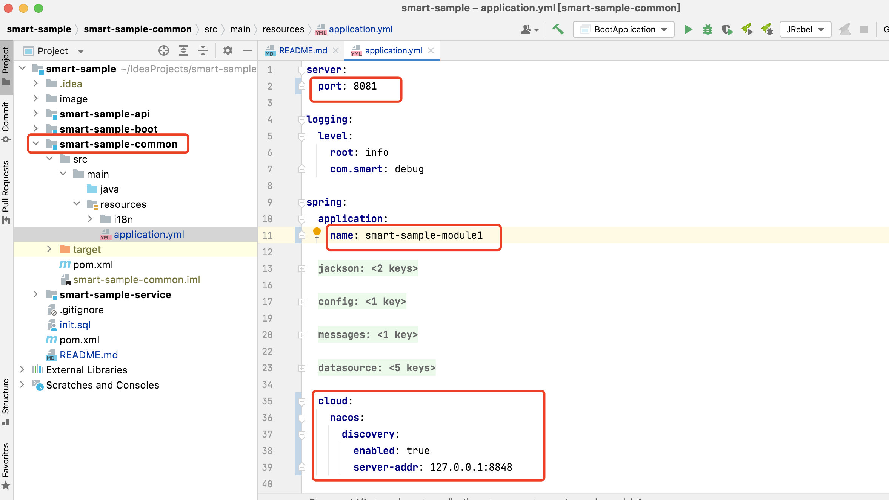

### 1.概述

Smart示例工程，介绍以[Smart](https://github.com/a466350665/smart)为技术底座的应用，推荐的模块结构、开发方式及如何支持单体和微服务的双重部署能力。

### 2.应用结构
```
smart-sample                                应用名称
├── smart-sample-common                     公共机制模块，存放公用配置文件和工具类
├── smart-sample-api                        API模块
│   ├── smart-sample-module1-api            业务模块1API，提供Feign接口示例
├── smart-sample-service                    业务模块
│   ├── smart-sample-module1                业务模块1，提供基础CRUD示例，Controller、Service、Mapper结构分层
│   ├── smart-sample-module2                业务模块2，提供模块间API调用示例
└── smart-sample-boot                       单体启动模块，依赖所有子业务模块
```

### 3.依赖关系


### 4.快速开始

#### 4.1 Mysql库创建及初始化
创建库名为smart_sample的数据库，在项目根目录下找到并执行初始化SQL文件init.sql，并修改数据库连接信息


#### 4.2 启动验证
找到启动类BootApplication直接run启动


### 5.公共能力说明

#### 5.1 分页
为解决组织采用了异构ORM导致分页实体不一致的情况，底座自定义了Page实体，各ORM分页实现需要统一转换为自定义的Page。
改MybatisPlus原生page/selectPage方法为扩展的findPage，如下图所示：


#### 5.2 国际化
messages_zh_CN.properties
```
601=\u4e3b\u952e\u4e0d\u80fd\u4e3a\u7a7a
602=\u7f16\u7801\u4e0d\u80fd\u4e3a\u7a7a
603=\u8C03\u7528{0}\u670D\u52A1\u5F02\u5E38! {1}
  ```
messages_en_US.properties
```
601=Id must not be null
602=Code must not be null
603=Exception calling {0} service! {1}
  ```
业务代码中使用如下：
```
String content = com.smart.core.entity.Message.get("603", param0, param1);
  ```

#### 5.3 异常
统一抛出com.smart.exception.ApplicationException或其子类，底座有统一的异常拦截报文处理。
建议使用枚举方式传参错误码，国际化支持以错误码枚举code作为key





#### 5.4 校验
支持SpringBoot标准的Validation校验方式，同时兼容国际化处理


#### 5.5 文档
主流的Swagger2，并简化配置


### 6.配置文件说明
为实现单体和微服务的双重部署方式这一目标，应用对业务模块公共属性提取共用，个性配置才由业务模块定义。

#### 6.1 公共配置
把公共配置提取到common模块的resources目录，通过import方式导入业务模块个性配置，实现配置文件共用。


#### 6.2 模块配置
业务模块个性配置通过在自身resources目录下创建{模块名称}/目录结构。


### 7.启动方式

#### 7.1 单体启动验证
参考[快速开始](https://github.com/a466350665/smart-sample#4%E5%BF%AB%E9%80%9F%E5%BC%80%E5%A7%8B)

#### 7.2 微服务启动验证
因Module2需要完成对Module1基于Feign远程调用，首先准备作为注册中心的Nacos。

##### 7.2.1 Module1启动验证
分别修改端口为8081、应用名称为smart-sample-module1，并打开注释掉的Nacos连接信息和pom.xml依赖（记得Maven reload一下），并运行启动类Module1Application




##### 7.2.2 Module2启动验证
分别修改端口为8082、应用名称为smart-sample-module2，打开Feign的客户端扫描注解和pom依赖（记得Maven reload一下），并运行启动类Module2Application


